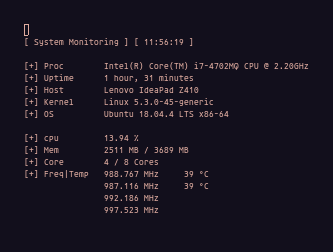
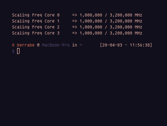
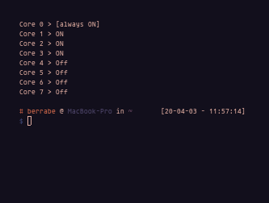

<p align="center">
  
</p>
<p align="center">
  
</p>
<p align="center">
  
</p>


# CPU-UTIL

 this is a script that I created for monitoring and setting up a laptop / computer CPU core.\
 
 features:
   - monitoring RAM, CPU Usage, CPU freq, CPU Temp, CPU Core Active
   - Set MAX CPU Frequency (cpufreq cannot exceed the specified limit)
   - turn on and off half of the available CPU cores (for ease of use)

# Installation

You can use this script very easily

```sh
$ git clone https://github.com/berrabe/cpu-util.git
$ cd cpu-util
$ sudo cp cpu-util /usr/bin/
```

# Help Page

Avail Mode
- [1] Monitoring         [ -mo ]
- [2] Set Max Frequency  [ -sf ]
- [3] Core Manager       [ -cm ]

Detail 
* -mo / --monitoring
  * watch system usage every 1 sec
* -sf / --set-freq [ freq in MHz | show ]
  * set MAX freq for all CPU cores
* -cm / --core-manager [ 0/1 | show ] 
  * turn on/off half of CPU cores
* -h / --help
  * show help page
* -v / --version 
  * print script version
* -cu / --check-update
  * check update from github

Example
- \# sudo cpu-util -mo
- \# sudo cpu-util -sf 1000000
- \# sudo cpu-util -sf show
- \# sudo cpu-util -cm 0
- \# sudo cpu-util -cm show